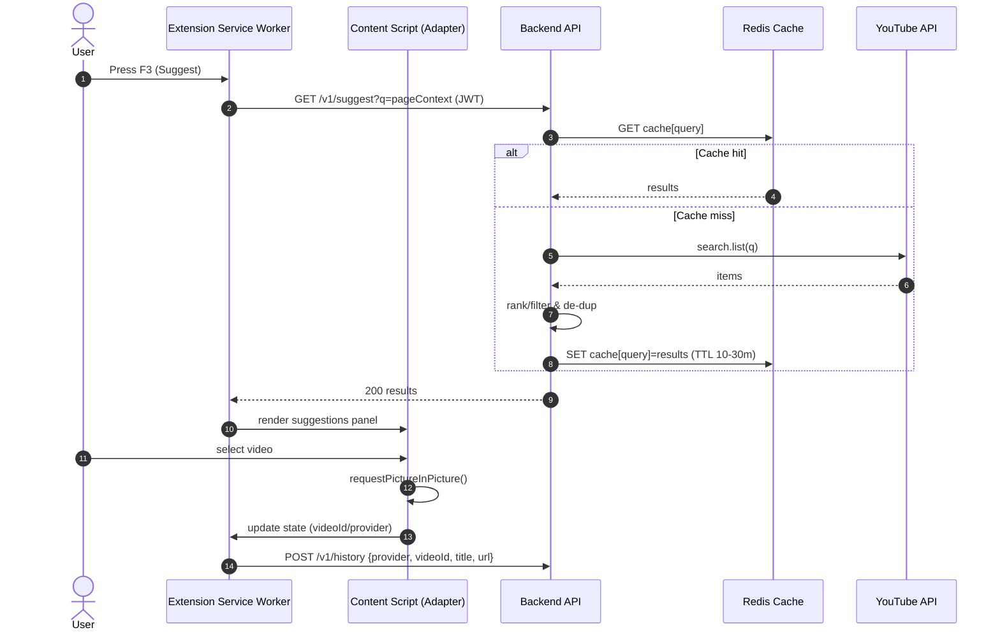

# Smart PiP — System Design Document (SDD)

## 0) Front‑matter

* **Purpose:** Describe the end‑to‑end design for Smart PiP to support implementation, review, and future scaling.
* **Scope:** Browser extension (MV3), backend API, data layer, auth, observability, and deployment.
* **Non‑Goals:** Native apps; cross‑browser ports (Safari/Firefox) beyond call‑outs; ML ranking beyond basic heuristics.
* **Owners:** Eng (Client/Backend), SRE, PM, Security.
* **Status:** Draft v1.0
* **Related Docs:** PRD/Use Cases, Tech Stack, Goals & KPIs, Reliability Requirements, Architecture Overview.
* **Glossary:**

  * **PiP**: Picture‑in‑Picture
  * **MV3**: Manifest V3 Chrome extension platform
  * **OIDC**: OpenID Connect (Google sign‑in)

---

## 1) Product Requirements Summary

**Core value:** Keep video visible and controllable while multitasking.
**Key features:**

1. **PiP control & persistence** — Enter/exit PiP; persists while source tab remains open (across windows in same profile).
2. **Media hotkeys** — F7 Back (seek ‑10s), F8 Play/Pause, F9 Skip (+10s).
3. **Productivity shortcuts** — F1 reopen last watched video in a new tab and start PiP; F2 (YouTube only) add current video to a chosen playlist; F3 suggest relevant YouTube videos from current page context.
4. **History** — Store the last 5 watched videos per user with provider labels (YouTube/Twitch/Vimeo).
5. **Auth** — Google OIDC; optional YouTube scopes for playlist write.
6. **Quality bar** — Low latency controls, high reliability, privacy‑first permissions, accessible overlay.

---

## 2) Assumptions & Constraints

* **Chrome MV3**: Service worker is ephemeral; use Alarms/Events to reduce cold‑start latency. No remote code execution; strict CSP.
* **Scope**: Operates within the same Chrome profile; can control videos across tabs/windows, not across different browsers.
* **Cross‑origin iframes**: Prefer site adapters injected on top‑level origins (youtube.com, vimeo.com, twitch.tv) to avoid iframe isolation issues.
* **YouTube API**: Search is server‑proxied (protect API key, uniform throttling). Playlist write is client‑side with minimal OAuth scopes unless user opts into server‑managed tokens.
* **Privacy**: Do not store watch history beyond last 5 entries; allow user purge.
* **Quota**: Respect YouTube Data API quotas; apply server‑side rate limits and caching.

---

## 3) High‑Level Architecture

```
User ─┬─ Chrome (MV3 Extension)
      │   ├─ Content Scripts (site adapters: YT/Vimeo/Twitch)
      │   ├─ Service Worker (commands, message bus, storage)
      │   └─ UI Surfaces (popup/options, PiP overlay)
      │
      └─ Backend (NestJS/Fastify)
          ├─ Auth (OIDC)
          ├─ Suggest (YouTube proxy)
          ├─ History (last 5 videos)
          ├─ Health & Metrics
          └─ Job Worker (BullMQ)

AWS ──► RDS Postgres ── Prisma
      ► ElastiCache Redis (cache, rate limits, queues)
      ► ALB + ECS Fargate (API & worker)
      ► Cloudflare (TLS/WAF/CDN)
Observability: OTel → Prometheus/Tempo/Loki (or Datadog); Sentry (client/server)
```

---

## 4) Detailed Component Design

### 4.1 Browser Extension (MV3)

**Structure**

* `manifest.json` — permissions (host\_permissions for youtube.com, vimeo.com, twitch.tv), commands (F1–F3, F7–F9), background service worker, content scripts, action UI.
* **Content Scripts (Site Adapters)**

  * Detect video element (`document.querySelector('video')` with robust fallbacks and `MutationObserver`).
  * Bind overlay controls (play/pause/seek) and publish capabilities to message bus.
  * Normalize per‑site quirks (e.g., YT Shorts player, Twitch theater mode).
* **Service Worker**

  * Listens to keyboard commands; routes to active tab’s adapter via `chrome.tabs.sendMessage`.
  * Maintains minimal session state in `chrome.storage.session` (current PiP source tabId, provider, videoId).
  * Manages F1/F2/F3 flows; invokes backend for Suggest; launches new tabs for F1.
  * Uses `chrome.alarms`/`onInstalled` events to mitigate cold‑start latency.
* **UI (Popup/Options + Overlay)**

  * Popup: per‑site toggles (Auto‑PiP on blur, skip interval), auth status, quick actions.
  * Options: permissions explanation, privacy controls (clear history), debug panel.
  * Overlay: keyboardable (ARIA), high‑contrast buttons, ESC/Space support.

**PiP Lifecycle**

* Enter: adapter calls `HTMLVideoElement.requestPictureInPicture()`; store source tabId + videoId.
* Persist: keep PiP active while source tab stays open, even if backgrounded; if navigating within site, rebind to the new video.
* Exit: user action or when source tab closes; overlay/worker cleans up state.

**Keyboard Mapping**

* F7: seek back (default ‑10s; configurable)
* F8: play/pause toggle
* F9: seek forward (+10s)
* F1: open last video (from backend `/history/last`) in new tab & auto‑PiP current tab
* F2: (YT only) add current to playlist — if not authed with YT scope, prompt OAuth consent
* F3: Suggest — send page context to backend `/suggest?q=...`

**Permissions**

* Minimal host permissions for supported sites; optional broader permission unlock gated behind clear UX.

---

### 4.2 Backend API (NestJS + Fastify)

**Modules**

* `AuthModule` — Google OIDC, session JWT, refresh rotation if server‑managed tokens are enabled (off by default).
* `HistoryModule` — CRUD for last‑5 entries; pruning policy.
* `SuggestModule` — Proxy to YouTube Search (key server‑side), heuristic ranking, caching.
* `HealthModule` — `/healthz` (liveness), `/readyz` (readiness), `/metrics` (Prom‑exposed).
* `JobsModule` — BullMQ workers (cleanup, caching warms, quota backoff).

**API (v1)**

* `POST /v1/auth/oidc/callback` — completes Google OIDC; sets HttpOnly session cookie or returns JWT to extension.
* `GET  /v1/history` — returns ≤5 items for current user.
* `POST /v1/history` — upsert `{provider, videoId, title, url, watchedAt}` and prune to 5.
* `DELETE /v1/history` — purge user history.
* `GET  /v1/history/last` — last entry convenience endpoint.
* `GET  /v1/suggest?q=<context>` — returns list of video suggestions with `{title, url, channel, viewCount, duration}`.
* `POST /v1/youtube/playlist` — (optional) server‑managed playlist write; requires elevated scope & consent flag.
* `GET  /healthz`, `GET /readyz`, `GET /metrics`

**Auth**

* OIDC login triggered from popup; backend mints short‑lived JWT (e.g., 15m) + rotating refresh (if cookie‑based).
* CORS allowlist to extension origins; rate‑limit unauth endpoints by IP.

**Validation & Errors**

* Centralized exception filter → structured JSON; 4xx for client errors; 5xx for transient.

---

### 4.3 Data Model (PostgreSQL via Prisma)

**Tables**

* `users(id uuid pk, oidc_sub text unique, created_at timestamptz default now())`
* `oauth_accounts(user_id fk, provider text, access_token text enc, refresh_token text enc, scope text, updated_at)`
* `video_history(id bigserial pk, user_id fk, provider text, video_id text, title text, url text, watched_at timestamptz)`
* `settings(user_id pk, auto_pip bool default false, skip_seconds int default 10, site_flags jsonb)`
* `audit_logs(id bigserial pk, user_id fk, event text, meta jsonb, created_at timestamptz)`

**Indexes**

* `video_history` on `(user_id, watched_at desc)`
* Partial index on `(user_id)` for pruning queries

**Pruning last 5**

```sql
-- After insert/update for a user, keep only 5 most recent
DELETE FROM video_history vh
WHERE vh.user_id = $1
  AND vh.id NOT IN (
    SELECT id FROM video_history
    WHERE user_id = $1
    ORDER BY watched_at DESC
    LIMIT 5
  );
```

---

## 5) Suggestion Ranking Logic

**Input:** Query terms from current tab (title, H1/H2, meta description, selected text if allowed).
**Backend:**

1. Normalize terms (lowercase, strip stopwords).
2. Call YouTube Search API (safe defaults, regionCode from browser locale).
3. Rank: `score = log(viewCount+1) + freshness_boost(publishedAt) + text_match(query,title,description)`
4. Cache by normalized query (Redis TTL 10–30 min) to absorb bursts.
5. Return top 5–10 results; omit videos already in user’s last‑5.

---

## 6) Scaling & Capacity Planning (Initial)

**Assumptions:** 500–1k DAU, 5–15 API calls/user/day.

* **RPS:** peak \~0.2–0.5 req/s average; bursts on Suggest.
* **DB:** history writes ≤10 QPS; reads ≤50 QPS; all trivially served by t4g.small RDS with 20–50 max conns via PgBouncer.
* **Cache:** Redis `cache.m6g.large` shared for rate limiting and jobs (BullMQ).
* **ECS:** 2× Fargate tasks (API) with 0.5 vCPU/1GB; 1× worker task 0.25 vCPU/0.5GB. AutoScale on CPU>60% or p95 latency>SLO.
* **Headroom:** 3× for 3 months.

---

## 7) Reliability Design

* **SLOs:** PiP success ≥99.5%/wk; API p95 <200ms; availability ≥99.9%.
* **Policies:** Error‑budget burn → freeze feature flags, revert latest rollout.
* **Resilience:**

  * Retries (exponential backoff) for Suggest API 5xx; circuit breaker on upstream quota errors.
  * Idempotent playlist writes (idempotency key per videoId+playlistId).
  * Graceful degradation: core PiP works without backend.
* **Backups:** RDS automated backups (7–14d), PITR; Redis not treated as system of record.

---

## 8) Security & Privacy

* **Extension:** Minimal host permissions; strict CSP; no eval; signed releases.
* **API:** JWT validation, least‑privilege IAM roles; Secrets in AWS Secrets Manager; KMS envelope encryption for any at‑rest tokens.
* **OAuth:** Request the minimum YouTube scopes; default is search‑only. Server‑managed refresh tokens are **opt‑in** and encrypted.
* **Data Retention:** Last‑5 history only; user‑initiated purge; account deletion removes data within 30 days.
* **Compliance Mindset:** Clear privacy policy; consent dialogs for scopes beyond basic sign‑in.

---

## 9) Observability

* **Metrics (client):** `pip_start`, `pip_end`, `command_latency_ms`, `adapter_name`, `errors`.
* **Metrics (server):** RPS, p50/p95/p99 latency per route, error rates, cache hit %, YT quota usage.
* **Tracing:** W3C trace‑context from extension → backend; sample 10%.
* **Logs:** Structured JSON with requestId/userId (hashed), privacy‑scrubbed.
* **Dashboards/Alerts:** SLO burn alerts; high error rate; cold‑start spikes; quota thresholds.

---

## 10) Testing Strategy

* **Unit:** adapters, command router, API services, pruning logic.
* **Integration:** end‑to‑end login, history flows, suggest proxy.
* **E2E (Playwright):** scripted runs against YT/Vimeo/Twitch fixtures; nightly smoke.
* **Security:** dependency scanning (Snyk), container image scanning (Trivy), secret detection (Gitleaks).
* **Perf:** Lighthouse for extension UI; k6 for API; synthetic latency monitors.

---

## 11) Deployment & Delivery

* **CI:** Lint/TypeCheck/Tests → build images → SBOM → sign → push to ECR.
* **CD:** Terraform (VPC, RDS, ElastiCache, ECS, ALB); Helm/Terraform for app releases; blue/green or rolling updates.
* **Config:** Environment via SSM Parameter Store/Secrets Manager; per‑env settings.
* **Release:** Chrome Web Store staged rollout (5% → 25% → 100%), feature flags via remote config.

---

## 12) Cost (rough, monthly)

* Fargate (2× API + 1× worker): \~\$30–\$80
* RDS t4g.small: \~\$60–\$90 (incl. storage & backups)
* ElastiCache small: \~\$30–\$60
* Cloudflare Free/Pro: \$0–\$20
* Sentry/Datadog (starter tiers): \$0–\$60
  *Total initial:* \$120–\$300/mo.

---

## 13) Risks & Mitigations

* **Site DOM drift** → adapter contracts, synthetic smoke tests, rapid patching via store.
* **MV3 cold‑start** → alarms/events, lazy but predictable background work.
* **Quota exhaustion** → Redis cache, adaptive backoff, server‑side throttles.
* **Permissions friction** → clear rationale, minimal defaults, opt‑in scopes.
* **OAuth review (YT)** → keep flows simple; avoid storing refresh tokens by default.

---

## 14) Alternatives Considered

* **No‑backend:** Use extension storage only. Rejected due to API key exposure and lack of centralized rate limiting.
* **Edge‑only (Workers):** Pros: global latency; Cons: relational storage and queues more complex early on.
* **Server‑managed playlists by default:** Rejected for privacy and scope creep; kept as explicit opt‑in.

---

## 15) Open Questions

* Default skip step (5s vs 10s vs configurable)?
* Should Suggest show channel + duration badges or minimalist titles only?
* Do we support playlist creation without visiting youtube.com (background add) or always deep‑link to keep consent obvious?
* Add optional “continue where you left off” on browser restart?

---

## 16) Appendix

### 16.1 Example OpenAPI (excerpt)

```yaml
openapi: 3.0.3
info: { title: Smart PiP API, version: 1.0.0 }
servers: [{ url: https://api.smartpip.app/v1 }]
paths:
  /history:
    get:
      security: [ { bearerAuth: [] } ]
      responses: { '200': { description: OK } }
    post:
      requestBody:
        required: true
        content:
          application/json:
            schema:
              type: object
              required: [provider, videoId, title, url]
              properties:
                provider: { type: string, enum: [youtube, vimeo, twitch] }
                videoId: { type: string }
                title: { type: string }
                url: { type: string, format: uri }
                watchedAt: { type: string, format: date-time }
      responses: { '204': { description: No Content } }
```

### 16.2 Prisma Schema (excerpt)

```prisma
model User {
  id        String   @id @default(uuid())
  oidcSub   String   @unique
  createdAt DateTime @default(now())
  history   VideoHistory[]
  settings  Settings?
}

model VideoHistory {
  id        BigInt   @id @default(autoincrement())
  user      User     @relation(fields: [userId], references: [id])
  userId    String
  provider  String
  videoId   String
  title     String
  url       String
  watchedAt DateTime @default(now())
  @@index([userId, watchedAt(sort: Desc)])
}

model Settings {
  user   User   @relation(fields: [userId], references: [id])
  userId String @id
  autoPip Boolean @default(false)
  skipSeconds Int @default(10)
  siteFlags  Json
}
```

### 16.3 Sequence (Mermaid)

```mermaid
sequenceDiagram
  autonumber
  actor U as User
  participant Ext as Extension (SW)
  participant CS as Content Script (Adapter)
  participant API as Backend API
  U->>Ext: Press F3 (Suggest)
  Ext->>API: GET /v1/suggest?q=tabContext (JWT)
  API->>API: Query cache / call YT, rank
  API-->>Ext: 200 [results]
  Ext->>CS: show panel; user picks video
  CS->>CS: requestPictureInPicture()
```

---

## 17) System Design Diagram (Context & Key Flow)

### 17.1 Context (C4 Level 1)

```mermaid
flowchart LR
  user((User))
  subgraph EXT[Chrome Browser — MV3 Extension]
    sw[Service Worker
(commands, state)]
    cs[Content Scripts
(Site Adapters)]
    ui[Popup/Options
PiP Overlay]
    sw <--> cs
    ui --> sw
  end

  subgraph CDN[Cloudflare TLS/WAF/CDN]
  end

  subgraph BE[AWS ECS Fargate]
    api[API (NestJS/Fastify)]
    worker[Job Worker (BullMQ)]
  end

  rds[(RDS PostgreSQL)]
  redis[(ElastiCache Redis)]
  yt[YouTube Data API v3]
  oidc[Google OIDC]
  obs[Observability
Prometheus/Grafana/Tempo/Loki]
  sentry[Sentry]

  user --> EXT
  EXT <--> CDN
  CDN --> api
  EXT <--> api
  api --> rds
  api --> redis
  api --> yt
  api --> oidc
  api --> obs
  api --> sentry
  worker --> redis
```

### 17.2 Key Flow — F3 Suggest → PiP


